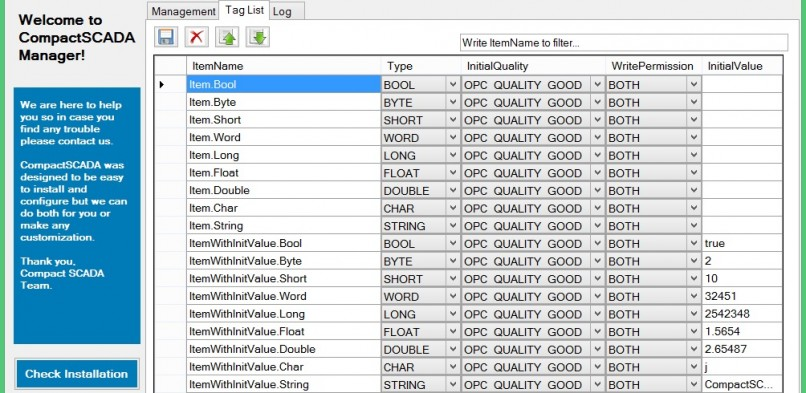

# CompactSCADA - Examples
CompactSCADA® integrates a reliable OPC Server and a built-in Web Service Server to allow access from any web application or device. This repository contains examples explaining how to interact with CompactSCADA.

CompactSCADA is a gateway for communication protocols, designed to be easy to configure and customize. The CompactSCADA core integrates the following protocols:

* **OPC-DA-SERVER:** An OPC-DA Server can communicate data continuously among PLCs on the shop floor, RTUs on the field, HMI stations, and software applications on desktop PCs. Interface to multiple OPC Clients that support OPC-DA 1.0a, 2.0 or 3.0 specifications.</li>
* **REST API:** CompactSCADA implements a RESTFul Interface that allows connections via HTTP GET/POST requests.</li>
* **WCF API:** Allows synchronous communication with other modules that implement our Microsoft WCF interface.</li>
	
<h3>Quick Installation Guide</h3>			
Find a step by step guide to install CompactSCADA <a title="Configuration tool included" href="http://compactscada.com/features/compactscada-quick-installation-process" target="_blank">here</a>.

<h3>What's Included</h3>
The following components are included with the CompactSCADA installer:
	
* **CompactSCADA Manager:** 
CompactSCADA Manager is a free tool to make CompactSCADA configuration, management and licensing even easier.
Find more information about CompactSCADA Manager&nbsp;<a title="Configuration tool included" href="http://compactscada.com/features/configuration-tool-included" target="_blank">here</a>.

* **Javascript API:** The CompactSCADA Javascript API library allows anyone to easily connect any website to CompactSCADA by abstracting the REST API.</li>
				
	
<h3>Visit Our Websites</h3>
Visit our websites for further information about CompactSCADA:

* <a title="CompactSCADA.com" href="http://compactscada.com" target="_blank">CompactSCADA.com: News, Events and Licensing</a>.
* <a title="CompactSCADA.com" href="http://docs.compactscada.com" target="_blank">CompactSCADA Documentation and Tutorials</a>.
